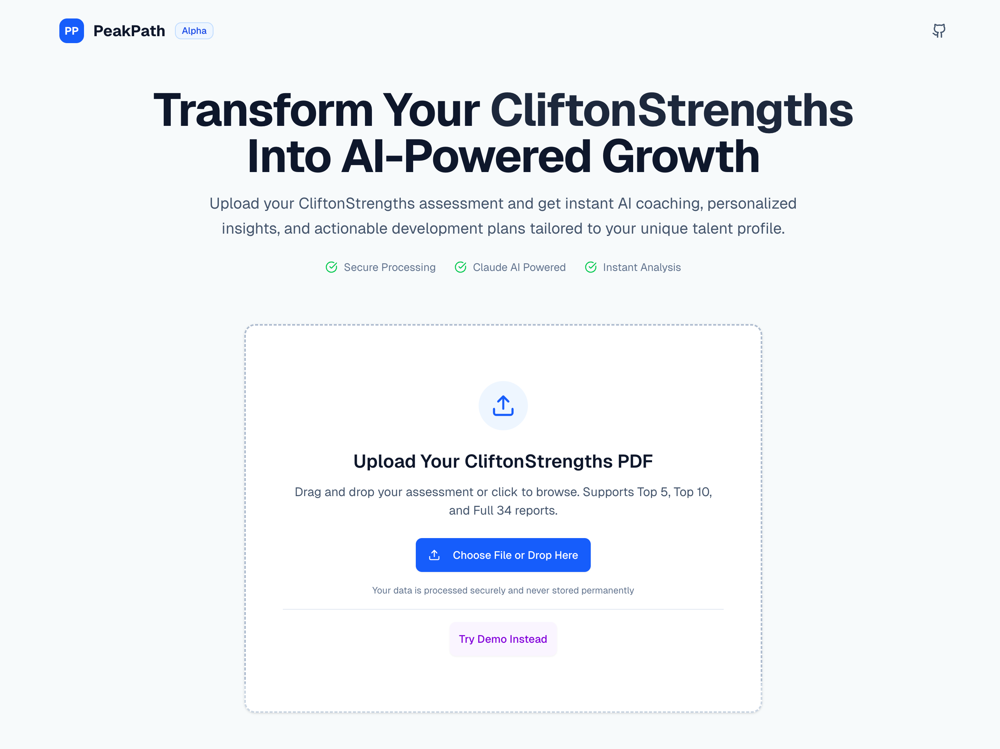
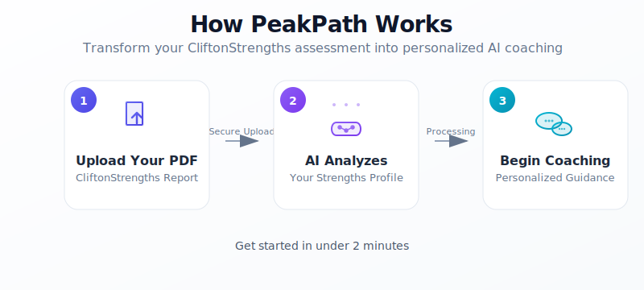
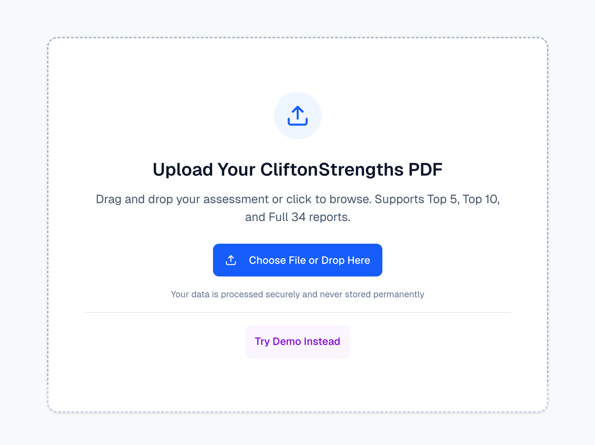
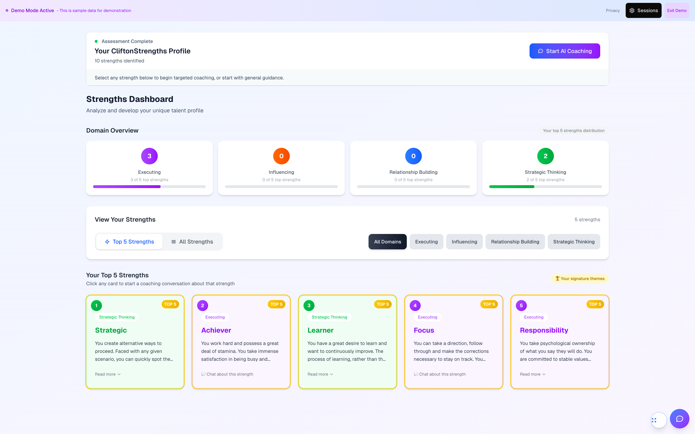

# PeakPath 🚀
### AI-Powered CliftonStrengths Coaching Platform

Transform your CliftonStrengths assessment into personalized AI coaching conversations. Upload your PDF, get instant insights, and develop your strengths with Claude AI.

[](https://peak-path.vercel.app) [](https://github.com/aporb/PeakPath) [](LICENSE) [](https://github.com/aporb/PeakPath/actions) [](https://peak-path.vercel.app) [](https://www.typescriptlang.org/) [](https://nextjs.org/)


*PeakPath landing page with a central PDF upload interface.*

---

## 📚 Table of Contents
- [🎥 Live Demo](#-live-demo)
- [⚡ Quick Start](#-quick-start)  
- [✨ Key Features](#-key-features)
- [🎯 See It In Action](#-see-it-in-action)
- [📸 Screenshots](#-screenshots)
- [🏗️ Architecture](#️-architecture)
- [🚀 Installation](#-installation)
- [🎮 Usage](#-usage)
- [🤝 Contributing](#-contributing)
- [📖 Documentation](#-documentation)
- [🆘 Support](#-support)

---

## 🎥 Live Demo

**Experience PeakPath instantly - no installation required!**

### 🌐 Try It Now
[](https://peak-path.vercel.app)

### 🎯 Demo Mode
Don't have a CliftonStrengths PDF? Click **"Try Demo Instead"** to experience the full platform with realistic sample data including Strategic, Achiever, Learner, Focus, and Responsibility strengths.

---

## ⚡ Quick Start

### Option 1: Try Online (30 seconds)
1. Visit **[peak-path.vercel.app](https://peak-path.vercel.app)**
2. Click **"Try Demo Instead"** for instant experience
3. Explore AI coaching with sample strengths data

### Option 2: Local Development (2 minutes)
```bash
git clone https://github.com/aporb/PeakPath.git
cd PeakPath/frontend
npm install
cp .env.example .env.local
# Add your CLAUDE_API_KEY to .env.local
npm run dev
```

Visit `http://localhost:8000` - Ready to coach! 🎉

---

## ✨ Key Features

<table>
  <tr>
    <td align="center">
      
      <br><strong>AI-Powered Coaching</strong>
      <br>Claude AI provides personalized insights and development strategies
    </td>
    <td align="center">
      
      <br><strong>Smart PDF Parsing</strong>
      <br>Upload any CliftonStrengths PDF (Top 5, 10, or Full 34)
    </td>
    <td align="center">
      
      <br><strong>Interactive Chat</strong>
      <br>Real-time coaching conversations with context awareness
    </td>
  </tr>
  <tr>
    <td align="center">
      
      <br><strong>Session Management</strong>
      <br>Local storage with multi-profile support and chat history
    </td>
    <td align="center">
      
      <br><strong>Demo Mode</strong>
      <br>Full experience with realistic sample data - no PDF required
    </td>
    <td align="center">
      
      <br><strong>Mobile-First</strong>
      <br>Responsive design optimized for all devices
    </td>
  </tr>
</table>

### 🎯 What Makes PeakPath Special

- **🧠 Contextual AI Coaching**: Unlike generic chatbots, understands your specific strengths profile
- **🔒 Privacy-First**: All data stays in your browser - no server storage of personal information  
- **🎨 Professional UI**: Built with shadcn/ui and Tailwind CSS for a polished experience
- **⚡ Instant Demo**: Try the full platform without uploading personal documents
- **🔄 Session Persistence**: Resume coaching conversations across browser sessions

## 🎯 See It In Action

Transform your CliftonStrengths assessment into personalized AI coaching in three simple steps:



<div align="center">

### Step 1: Upload Your PDF

*Upload any CliftonStrengths PDF (Top 5, 10, or Full 34) or try our demo mode with realistic sample data.*

---

### Step 2: Explore Your Dashboard  

*Discover your personalized strengths dashboard with domain breakdowns, detailed strength cards, and AI-powered insights tailored to your unique profile.*

---

### Step 3: Start AI Coaching
💬 **Interactive Conversations** - Engage with Claude AI for personalized development strategies, strength-building exercises, and career guidance based on your specific CliftonStrengths profile.

</div>

**Ready to experience it yourself?** [](https://peak-path.vercel.app)

---

## 🏗️ Architecture


### Project Structure
```
PeakPath/
├── 📁 frontend/              # Next.js 15 Full-Stack App
│   ├── 📁 src/app/          # App Router (pages & API routes)
│   ├── 📁 components/       # React components + shadcn/ui
│   └── 📁 lib/              # Utilities & services
└── 📁 docs/                 # Documentation
```

### Tech Stack
- **Frontend**: Next.js 15, React 18, TypeScript
- **UI**: shadcn/ui, Tailwind CSS, Radix UI
- **AI**: Claude API (Anthropic)
- **Storage**: Browser localStorage (privacy-first)
- **Deployment**: Vercel (with serverless functions)

---

## 🚀 Installation

### Prerequisites
- Node.js 18+ and npm 9+
- Claude API key from [Anthropic Console](https://console.anthropic.com/)

### Development Setup

1. **Clone Repository**
```bash
git clone https://github.com/aporb/PeakPath.git
cd PeakPath
```

2. **Install Dependencies**
```bash
cd frontend
npm install
```

3. **Environment Configuration**
```bash
cp .env.example .env.local

# Add to .env.local:
CLAUDE_API_KEY=your_anthropic_api_key_here
CLAUDE_MODEL=claude-4-sonnet
NODE_ENV=development
```

4. **Start Development Server**
```bash
npm run dev
```
Application runs at `http://localhost:8000`

### Production Deployment

**Deploy to Vercel (Recommended):**
```bash
npm install -g vercel
vercel --prod
```

Set environment variables in Vercel dashboard:
- `CLAUDE_API_KEY`: Your Anthropic API key

---

## 🎮 Usage

### For Individuals
1. **Upload your CliftonStrengths PDF** or try demo mode
2. **Explore your strengths** through the interactive dashboard
3. **Start coaching conversations** for personalized development insights
4. **Save sessions** for continued growth over time

### For Coaches & Organizations
- **Multi-client support** through session management
- **Contextual coaching** based on individual strength profiles  
- **Development planning** with AI-generated recommendations
- **Progress tracking** through conversation history

### API Usage
```typescript
// Upload CliftonStrengths PDF
const formData = new FormData();
formData.append('pdf', file);
const profile = await fetch('/api/upload', {
  method: 'POST',
  body: formData
}).then(res => res.json());

// Get AI coaching response
const coaching = await fetch('/api/coach', {
  method: 'POST',
  headers: { 'Content-Type': 'application/json' },
  body: JSON.stringify({
    message: "How can I develop my Strategic strength?",
    strengthContext: "Strategic",
    profileId: profile.id
  })
}).then(res => res.json());
```

---

## 🤝 Contributing

We welcome contributions! Here's how to get started:

### Quick Contributing Guide

1. **Fork the repository**
2. **Create your feature branch**: `git checkout -b feature/amazing-feature`
3. **Make your changes** following our code standards
4. **Test thoroughly** with `npm run build` and `npm run lint`
5. **Commit your changes**: `git commit -m 'Add amazing feature'`
6. **Push to the branch**: `git push origin feature/amazing-feature`
7. **Open a Pull Request**

### Development Standards
- **TypeScript**: Full type safety required
- **ESLint/Prettier**: Follow configured code style
- **Testing**: Ensure components render correctly
- **Documentation**: Update relevant docs for new features

### Areas We Need Help With
- 🎨 **Visual Design**: UI/UX improvements and additional visual assets
- 🧪 **Testing**: Unit and integration tests
- 📝 **Documentation**: Tutorials and guides
- 🌐 **Internationalization**: Multi-language support
- ♿ **Accessibility**: WCAG 2.2 AA compliance

---

## 📖 Documentation

### Core Documentation
- **[Architecture Guide](docs/development/ARCHITECTURE.md)** - Technical architecture and design decisions
- **[API Reference](docs/development/API.md)** - Complete API documentation (Coming Soon)
- **[Deployment Guide](docs/deployment/)** - Production deployment instructions  
- **[Contributing Guide](docs/CONTRIBUTING.md)** - Development workflow and standards

### User Guides
- **[Getting Started](docs/user/getting-started.md)** - Step-by-step user onboarding (Coming Soon)
- **[Demo Mode Guide](docs/user/demo-mode.md)** - Understanding demo features (Coming Soon)
- **[Session Management](docs/user/session-management.md)** - Managing multiple profiles (Coming Soon)

### Development
- **[Frontend README](frontend/README.md)** - Frontend-specific documentation
- **[Component Library](docs/development/components.md)** - shadcn/ui component usage (Coming Soon)
- **[Development Setup](docs/development/development.md)** - Local development guide (Coming Soon)

---

## 🆘 Support

### Getting Help
- 🐛 **Bug Reports**: [Create an issue](https://github.com/aporb/PeakPath/issues/new?template=bug_report.md)
- 💡 **Feature Requests**: [Request a feature](https://github.com/aporb/PeakPath/issues/new?template=feature_request.md)
- 💬 **Discussions**: [GitHub Discussions](https://github.com/aporb/PeakPath/discussions)
- 📧 **Direct Contact**: [Open an issue](https://github.com/aporb/PeakPath/issues) for project-related questions

### Troubleshooting Common Issues

<details>
<summary><strong>Application won't start locally</strong></summary>

```bash
# Clear cache and reinstall
rm -rf .next node_modules package-lock.json
npm install
npm run dev
```
</details>

<details>
<summary><strong>PDF upload failing</strong></summary>

- Ensure file is a valid CliftonStrengths PDF
- Check file size (10MB limit)
- Verify PDF contains readable text (not just images)
</details>

<details>
<summary><strong>Claude API errors</strong></summary>

- Verify `CLAUDE_API_KEY` in environment variables
- Check API key permissions and quotas at console.anthropic.com
- Monitor rate limiting in browser console
</details>

### Performance & Browser Support
- **Browsers**: Chrome 88+, Firefox 84+, Safari 14+, Edge 88+
- **Mobile**: iOS Safari 14+, Chrome Android 88+
- **Performance**: Lighthouse score 95+ (Performance, Accessibility, Best Practices)

---

## 📊 Project Status

### Current Version: 1.0.0
- ✅ **Core Features**: PDF parsing, AI coaching, session management
- ✅ **Demo Mode**: Complete sample experience
- ✅ **Mobile Responsive**: Optimized for all devices
- ✅ **Production Ready**: Deployed and stable

### Roadmap
- 🔜 **Team Analytics**: Multi-profile team insights
- 🔜 **Export Features**: PDF reports and development plans
- 🔜 **API Integrations**: Connect with other coaching tools
- 🔜 **Offline Mode**: PWA capabilities for offline coaching

---

## 📄 License

This project is licensed under the **GNU Affero General Public License v3.0** - see the [LICENSE](LICENSE) file for details.

**Why AGPL?** This ensures that any improvements or modifications to PeakPath, including hosted versions, remain open source and benefit the entire community.

---

## 🌟 Show Your Support

If PeakPath helps you develop your strengths, please consider:
- ⭐ **Star this repository** on GitHub
- 🐦 **Share it** with your network
- 🐛 **Report issues** or suggest improvements
- 🤝 **Contribute** to make it even better

---

## 🙏 Acknowledgments

- **Anthropic** for the incredible Claude AI that powers our coaching
- **Gallup** for the CliftonStrengths framework and assessment
- **shadcn/ui** for the beautiful, accessible component library
- **Vercel** for seamless deployment and hosting
- **Open Source Community** for the tools and libraries that make this possible

---

<div align="center">

**Built with ❤️ using Next.js, TypeScript, and shadcn/ui**  
**Deployed on Vercel**

[](https://peak-path.vercel.app)

*Transform your strengths into your competitive advantage*

</div>